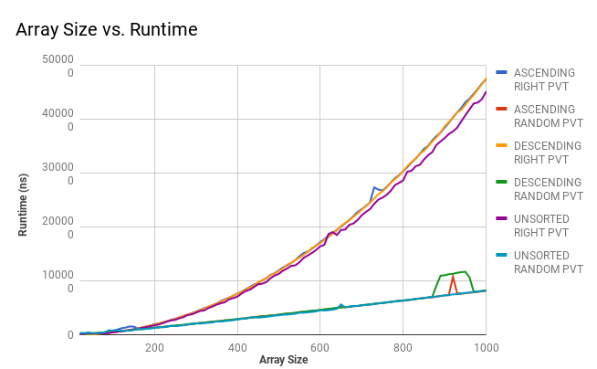

# Team QuestionMark
## :fire: Brandon Chung :fire: Tim Marder :fire: Bo Hui Lu :fire:

## Hypothesis

**Worst Case:** O(n²) - We believe the arrays sorted in descending order will take the longest time because it will have to perform the most amount of swaps to recieve a sorted array as a result.

**Average Case:** O(nlogn) - We believe the arrays sorted in random order will take average because it is the happy medium between the sorted ascending array and the sorted descending array.

**Best Case:** O(nlogn) - We believe the arrays sorted in ascending order will take the shortest time because it will have to perform the least amount of swaps to recieve a sorted array as a result.

## Background

Quicksort is a divide and conquer algorithm for sorting. Quicksort first divides a large array into two sub-arrays: the elements lower than a pivot point and the elements higher than the same pivot. Quicksort can then recursively sort the sub-arrays efficiently.

## Methodology
On arrays with sizes that increase up to 100, run 1000 trials on each size, testing the time it takes to run the sort. This is ran on 6 different situations. With the pivot position starting on the right, we ran it with unsorted arrays, sorted in ascending order arrays, and sorted in descending order arrays. We did the same for pivot positions starting at a random location.

## Results

//Note: Add explanation

Click [HERE](https://docs.google.com/spreadsheets/d/1q22Ehk9i-vj1uPWFPUR6ZZH4ooD-bB5hUb8s-f-cKGY/edit?usp=sharing) to view our raw data.

## Conclusion

For all our tests when starting on a random pvtPos, the runtime was significantly faster than those of a pvt starting on the right. When running QuickSort with a right pivot, all three tests had similar runtimes. Likewise, the ones running QuickSort with a random pivot were consistent with each other. 

Some differences we noticed in our graphs were occasional spikes in our graphs. We cannot completely explain this. However, one reason may be due to our processing system and its slight variations in efficiency. Another speculation is the random pivots were coincidentally randomly choosen such that the sorting time was longer relative to the trend it should have followed.

A next step would be to test QuickSort using a more centered pivot and compare it to the random pivot.
