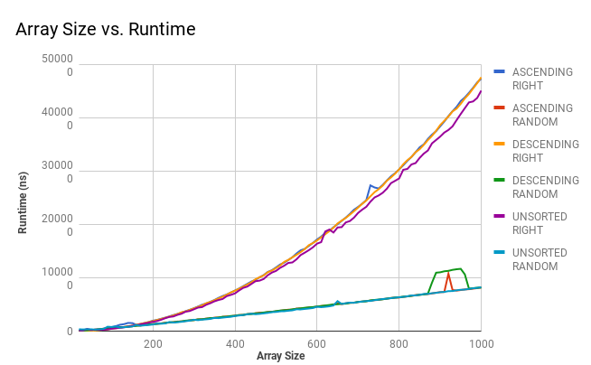

# Team QuestionMark
## :fire: Tim Marder :fire: Brandon Chung :fire: Bo Hui Lu :fire:

## Hypothesis

**Worst Case:** O(logn²)

**Average Case:** O(nlogn)

**Best Case:** O(nlogn)

//Note: Add Explanations

## Background

## Methodology
On arrays with sizes that increase up to 100, run 1000 trials on each size, testing the time it takes to run the sort. This is ran on 6 different situations. With the pivot position starting on the right, we ran it with unsorted arrays, sorted in ascending order arrays, and sorted in descending order arrays. We did the same for pivot positions starting at a random location.

## Results

//Note: Add explanation

When the array is unsorted, having the pvtPos on the right vs. having a random pvtPos, both resulted in similar runtimes. However, for both variations of sorted arrays, having the pvtPos on the right resulted in significantly faster runtimes than starting at a random pvtPos.

Click [HERE](https://docs.google.com/spreadsheets/d/1q22Ehk9i-vj1uPWFPUR6ZZH4ooD-bB5hUb8s-f-cKGY/edit?usp=sharing) to view our raw data.

## Conclusion

